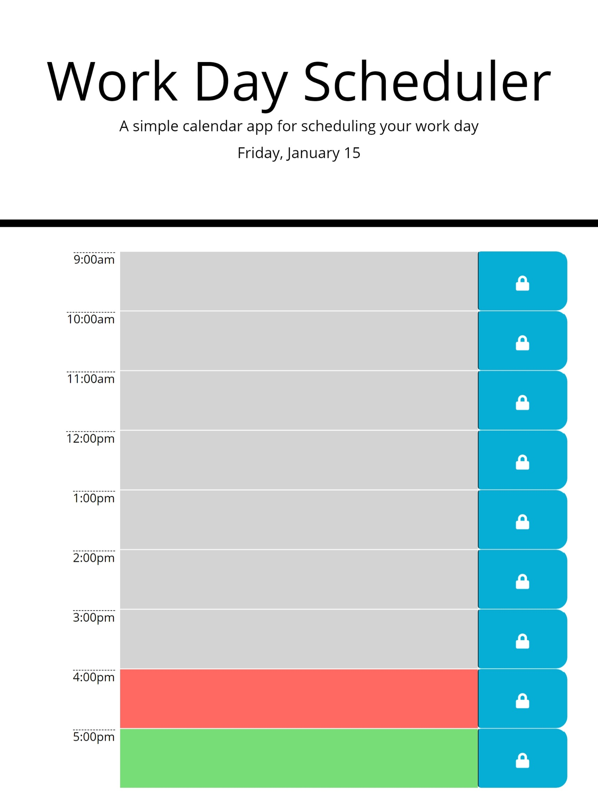

>## Day Planner Project
---
For this project I took a bit of basic code and built upon it to create an interactive day planner which allows for a bit of time management!

### Features
- current date displayed at the top of the page
- individual time slots for each hour with customizable task slot
- a lock button to transfer tasks into the localStorage for retention.
- a color code to indicate how many hours of the workday have passed!
---
below you will find a link to the project and a screenshot of the site! Please enjoy!

[link to the site](https://jpeyton-hub.github.io/Interactive_Day_Planner/)

